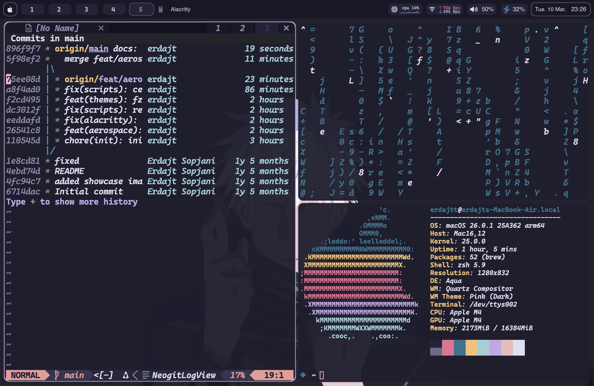
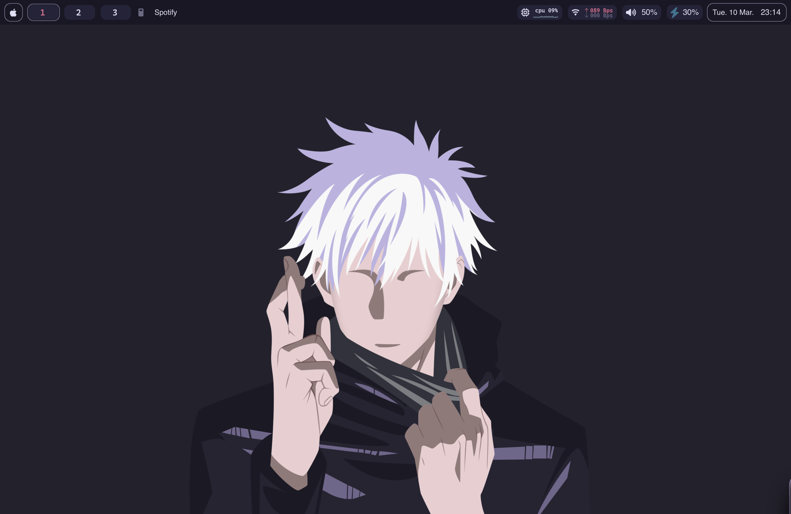
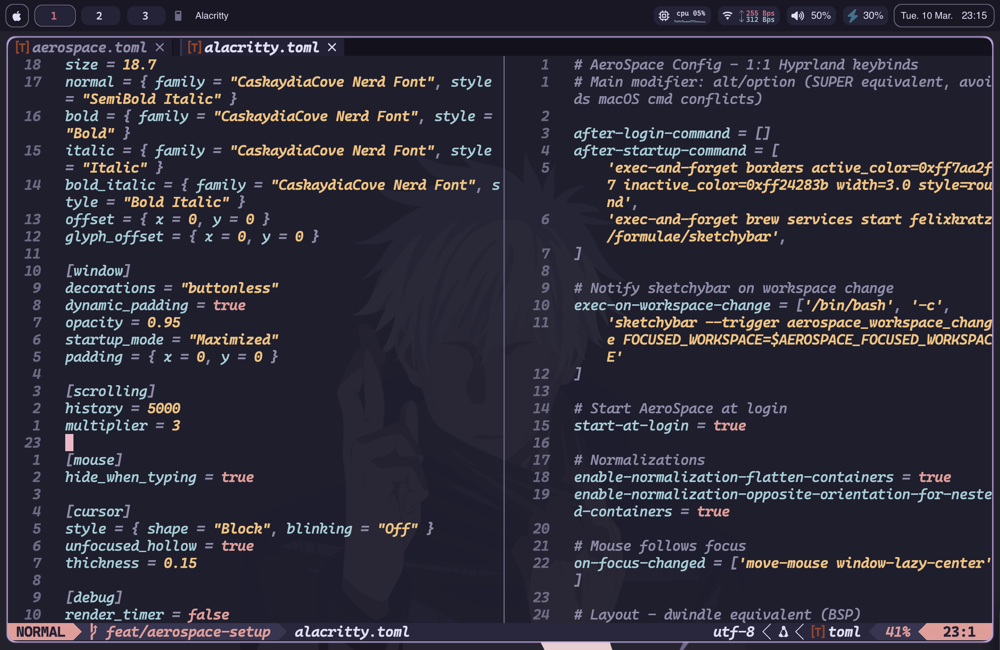
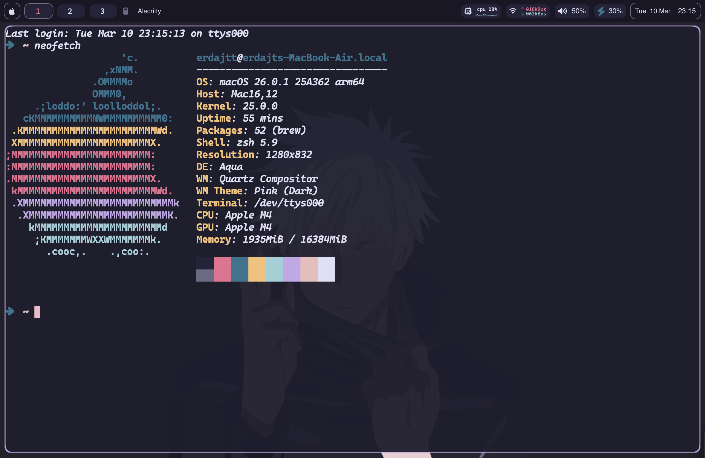
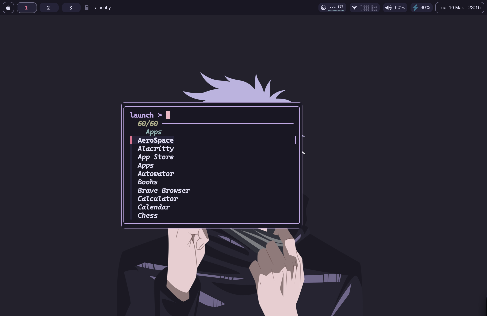
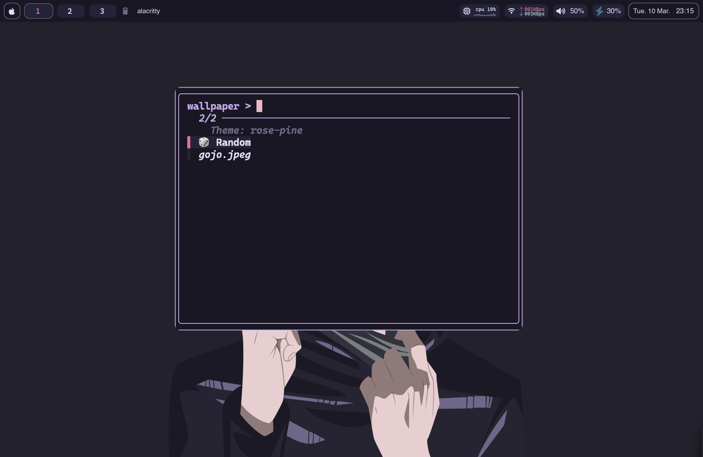
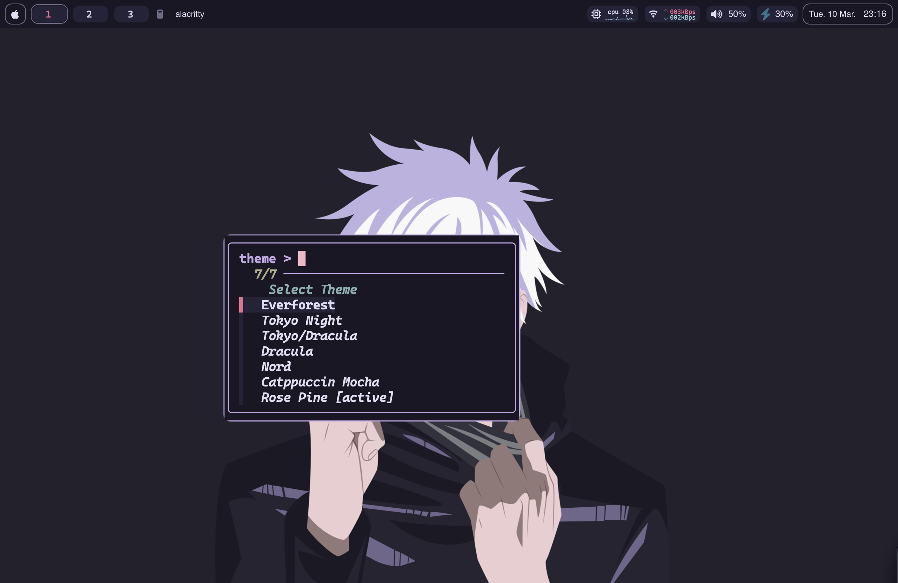

<h1 align="center">macOS Dotfiles</h1>

<p align="center">
  1:1 port of my <a href="https://github.com/erdajt/hyprdots">Hyprland setup</a> to macOS. Same themes, keybinds, workflow.
</p>



<table>
  <tr>
    <td></td>
    <td></td>
  </tr>
  <tr>
    <td></td>
    <td></td>
  </tr>
  <tr>
    <td></td>
    <td></td>
  </tr>
</table>

<a name="readme-top"></a>

[![Contributors][contributors-shield]][contributors-url]
[![Forks][forks-shield]][forks-url]
[![Stargazers][stars-shield]][stars-url]
[![Issues][issues-shield]][issues-url]

---

## About

Direct copy of my [Hyprland rice](https://github.com/erdajt/hyprdots) on macOS. Same 7 themes, vim keybinds, tiling workflow. Hyprland swapped for AeroSpace, Waybar for SketchyBar, rofi for fzf.

### Stack

| Component | Tool |
|---|---|
| Tiling WM | [AeroSpace](https://github.com/nikitabobko/AeroSpace) |
| Status Bar | [SketchyBar](https://github.com/FelixKratz/SketchyBar) (Lua config) |
| Window Borders | [JankyBorders](https://github.com/FelixKratz/JankyBorders) |
| Terminal | [Alacritty](https://github.com/alacritty/alacritty) |
| Editor | [Neovim](https://github.com/neovim/neovim) (config on [macos branch](https://github.com/erdajt/nvim/tree/macos)) |
| App Launcher | fzf in floating Alacritty |
| Spotify | [Spicetify](https://spicetify.app/) with TokyoNight theme |
| Shell | zsh + oh-my-zsh + zsh-vi-mode |

---

## Features

### 7 Themes

Switch all themes globally with `opt+shift+t`. Changes alacritty, sketchybar, borders, and fzf pickers all at once.

- Tokyo Night
- Everforest
- Dracula
- Tokyo/Dracula
- Nord
- Catppuccin Mocha
- Rose Pine

Active theme saved in `~/.config/aerospace/.theme-state`.

### fzf Pickers

Themed floating alacritty windows with fzf. Colors match the active theme.

- **App Launcher** (`opt+space`) - fuzzy search installed apps
- **Theme Picker** (`opt+shift+t`) - switch themes
- **Wallpaper Picker** (`opt+w`) - pick from `~/Pictures/Wallpapers/`

### Keybinds

Modifier is `opt` (option), same as `SUPER` in Hyprland.

| Keybind | Action |
|---|---|
| `opt+q` | Open Alacritty |
| `opt+shift+q` | Close window |
| `opt+e` | Open Finder |
| `opt+space` | App launcher |
| `opt+h/j/k/l` | Focus left/down/up/right |
| `opt+shift+h/j/k/l` | Move window left/down/up/right |
| `opt+1-0` | Workspace 1-10 |
| `opt+shift+1-0` | Move window to workspace (follows focus) |
| `opt+f` | Fullscreen |
| `opt+shift+v` | Toggle floating |
| `opt+i` | Toggle split orientation |
| `opt+r` | Resize mode (h/j/k/l) |
| `opt+b` | Balance sizes |
| `opt+s` | Screenshot to clipboard |
| `opt+shift+s` | Screenshot to ~/Screenshots |
| `opt+w` | Wallpaper picker |
| `opt+shift+t` | Theme picker |
| `opt+shift+a/d` | Decrease/increase opacity |
| `opt+d` | Dismiss notifications |
| `opt+shift+w` | Toggle SketchyBar |
| `opt+shift+r` | Reload config |

### SketchyBar

Lua config with:
- Aerospace workspace indicators (shows occupied/focused only)
- Theme colors reload on switch
- CPU, WiFi, battery, volume, media widgets
- NerdFont icons (CaskaydiaCove Nerd Font)

### Alacritty

- CaskaydiaCove Nerd Font, size 18.7
- 0.95 opacity, adjustable with keybinds
- Buttonless, starts maximized
- 7 theme files swap on theme switch

---

## Install

### Dependencies

```bash
brew install --cask alacritty
brew install --cask aerospace
brew tap FelixKratz/formulae
brew install sketchybar
brew install borders
brew install fzf
brew install neovim
brew install spicetify-cli

# oh-my-zsh + vi mode
sh -c "$(curl -fsSL https://raw.githubusercontent.com/ohmyzsh/ohmyzsh/master/tools/install.sh)"
git clone https://github.com/jeffreytse/zsh-vi-mode ${ZSH_CUSTOM:-~/.oh-my-zsh/custom}/plugins/zsh-vi-mode

# SbarLua (needed for sketchybar lua config)
git clone https://github.com/FelixKratz/SbarLua.git /tmp/SbarLua
cd /tmp/SbarLua && make install && cd -

# font: CaskaydiaCove Nerd Font
# https://www.nerdfonts.com/font-downloads
```

### Setup

```bash
git clone https://github.com/erdajt/macdotfiles.git
cd macdotfiles

cp -r aerospace ~/.config/
cp -r alacritty ~/.config/
cp -r borders ~/.config/
cp -r sketchybar ~/.config/
cp -r spicetify/Themes/* ~/.config/spicetify/Themes/
cp .zshrc ~/

chmod +x ~/.config/aerospace/scripts/*.sh
chmod +x ~/.config/alacritty/opacity.sh

brew services start felixkratz/formulae/sketchybar

spicetify config current_theme TokyoNight
spicetify apply

# wallpapers go here
mkdir -p ~/Pictures/Wallpapers
```

### Optional

```bash
# disable macos shortcuts that conflict with aerospace
~/.config/aerospace/scripts/disable-macos-hotkeys.sh
# log out and back in after
```

---

## Credits

- Themes ported from my [Hyprland dots](https://github.com/erdajt/hyprdots)
- SketchyBar config based on [FelixKratz/dotfiles](https://github.com/FelixKratz/dotfiles)
- [AeroSpace](https://github.com/nikitabobko/AeroSpace) by nikitabobko
- [SketchyBar](https://github.com/FelixKratz/SketchyBar) + [JankyBorders](https://github.com/FelixKratz/JankyBorders) by FelixKratz

<p align="right">(<a href="#readme-top">back to top</a>)</p>

<!-- MARKDOWN LINKS & IMAGES -->
[contributors-shield]: https://img.shields.io/github/contributors/erdajt/macdotfiles?style=for-the-badge
[contributors-url]: https://github.com/erdajt/macdotfiles/graphs/contributors
[forks-shield]: https://img.shields.io/github/forks/erdajt/macdotfiles?style=for-the-badge
[forks-url]: https://github.com/erdajt/macdotfiles/network/members
[stars-shield]: https://img.shields.io/github/stars/erdajt/macdotfiles?style=for-the-badge
[stars-url]: https://github.com/erdajt/macdotfiles/stargazers
[issues-shield]: https://img.shields.io/github/issues/erdajt/macdotfiles?style=for-the-badge
[issues-url]: https://github.com/erdajt/macdotfiles/issues
